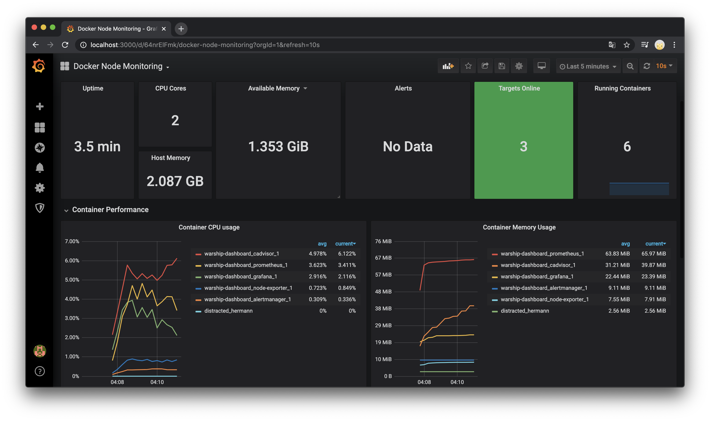

#### docker-composer based solution for monitor and alert of  host node and docker containers


```sh
git clone https://github.com/shemul/docker-node-monitor.git
cd docker-node-monitor
docker-compose up
```
you will have your grafana up and running on `http://localhost:3000` with dashboard ready. default password `laddu` from `./grafana/config.monitoring`




#####  Todos
```inform7
- update readme.md
- multiple data-source support 
- email receiver in alertmanager
```

_powered by_ [Prometheus](https://prometheus.io/), [Node_Exporter](https://github.com/prometheus/node_exporter), [cAdvisor](https://github.com/google/cadvisor), [alertmanager](https://prometheus.io/docs/alerting/alertmanager/) [Grafana](https://grafana.com/)